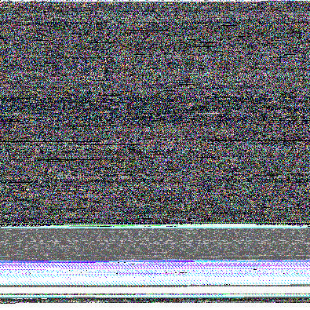

# make_image.py

Makes a pair CMYK color image saved as jpeg based on any file.  Very primitive and silly, and not guaranteed to reveal
secret bible-code-like data trends, but hey, that's sort of the point :). The second image is a 15x15 section of the first 225 32-bit words of data
enlarged to the same size as the whole image.

Usage:  `make_image.py <filename>`

` ./make_image.py /bin/bash # creates a jpeg from your bash shell executable`

